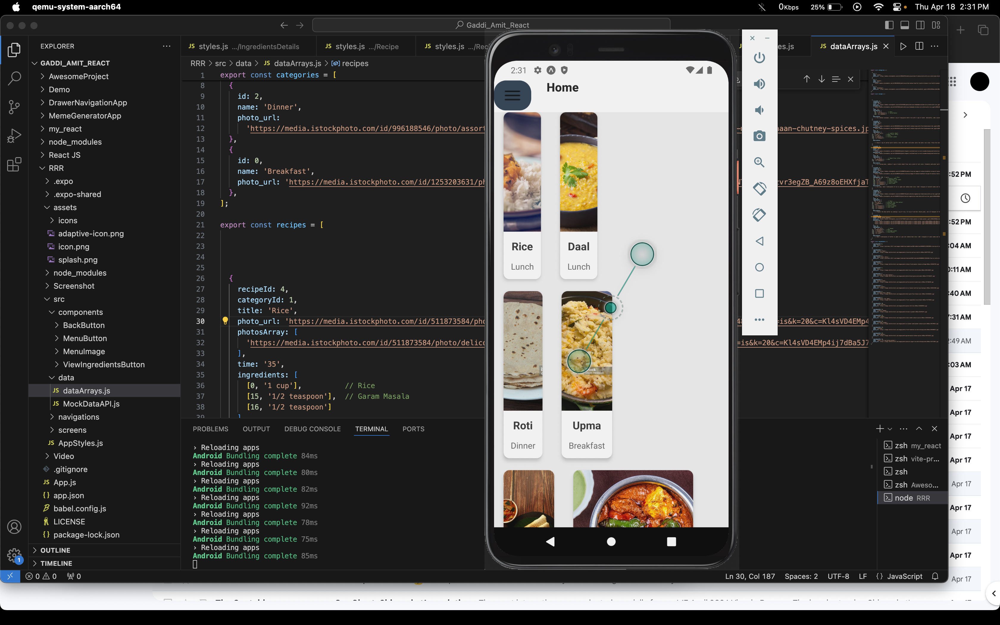
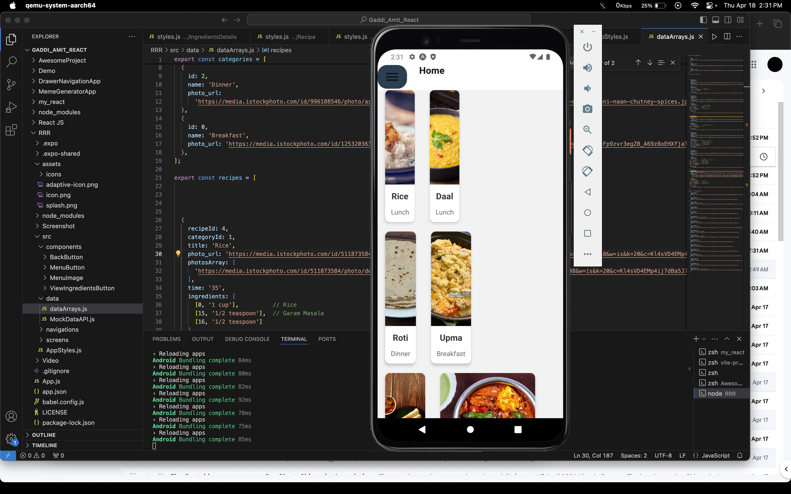
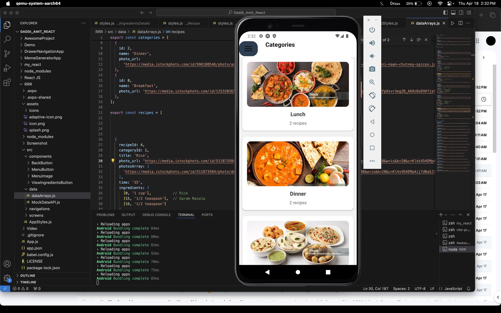
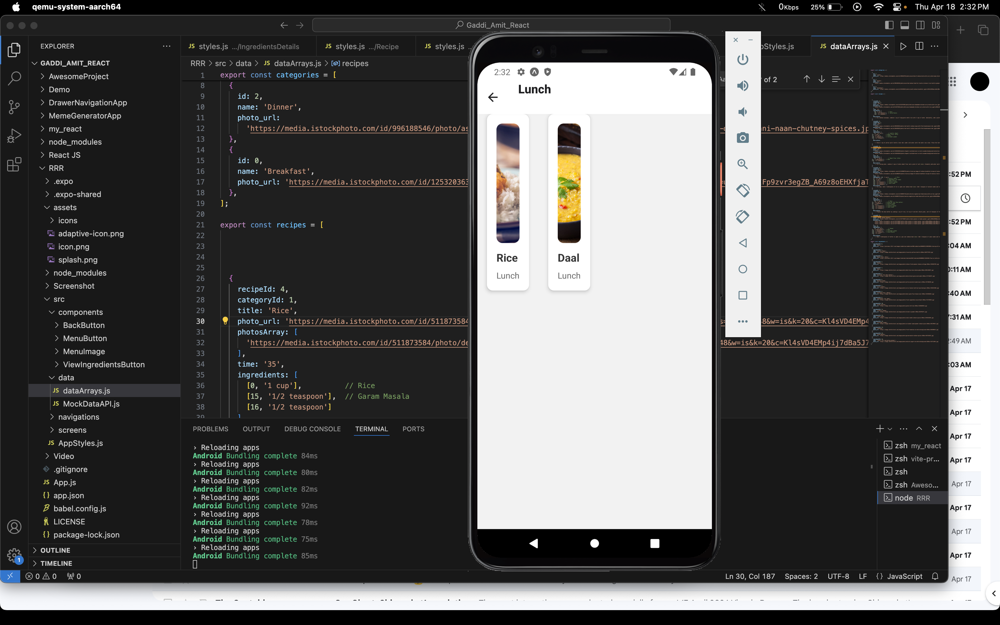
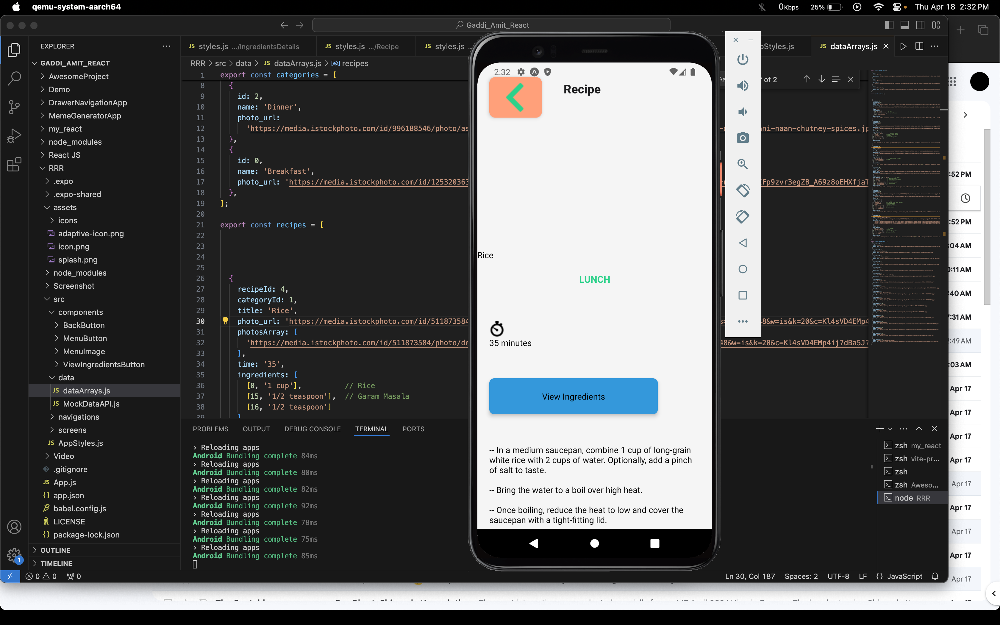
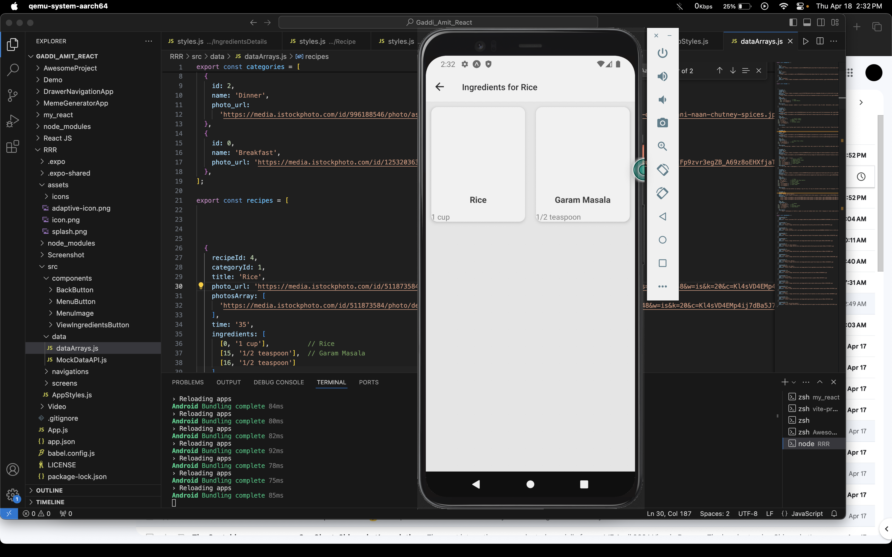
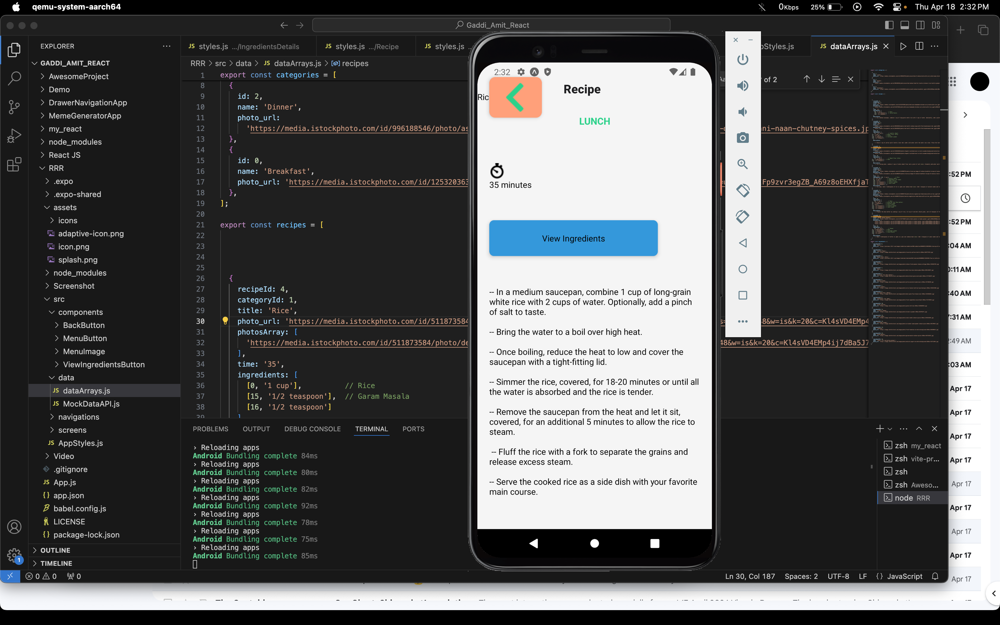
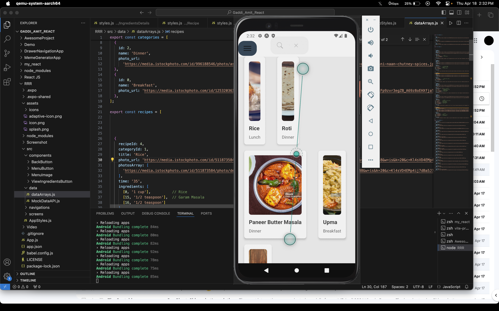

# RRR - Rapid Recipe Routine

## Team Members
**Names**
- Amit Gaddi - M15886780
- Taraka Ram Annapaneni - M15889383
- Navya Kala Mudunuri - M15888006

## Project Overview and Description

**Overview:** Rapid Recipe Routine is a revolutionary mobile app designed to make meal planning and cooking easier for people of all culinary skill levels. The app addresses common issues like time constraints, limited access to ingredients, and confusion about cooking instructions. Rapid Recipe Routine uses technology to streamline the entire cooking process, including recipe discovery, grocery shopping, and meal preparation.

**Description:** Rapid Recipe Routine transforms the way people approach home cooking by providing a user-friendly platform suitable for users of all skill levels. At its core, the app aims to make cooking more accessible and enjoyable by providing personalized recipe recommendations, simple instructions, and customizable shopping lists.

Users can easily find new recipes tailored to their preferences and dietary needs, eliminating the guesswork that often comes with meal planning. The app's user-friendly interface makes it easy to navigate through recipes, with clear instructions and ingredient lists to help with cooking.

One of the most important features of Rapid Recipe Routine is its ability to optimize ingredient usage, allowing users to reduce waste and save money. The app ensures that users only buy what they need by creating customized shopping lists based on selected recipes, reducing unnecessary costs and food waste.

Rapid Recipe Routine is an excellent learning tool for beginners in the kitchen, offering systematic guidance and access to a wide variety of dishes. Users can gain confidence and learn important cooking skills at their own pace thanks to step-by-step instructions and interactive features.

Furthermore, Rapid Recipe Routine promotes a thriving community of foodies through features such as recipe sharing, ratings, and reviews. This sense of community fosters collaboration and support among users, resulting in an engaging platform for sharing culinary experiences and discovering new recipes.

In conclusion, Rapid Recipe Routine is more than just a cooking app; it is a comprehensive solution that enables people to enjoy home cooking with confidence and ease. The app aims to revolutionize the way people experience and enjoy food by combining technology and a user-centric approach, encouraging healthier eating habits, saving time and money, and fostering a sense of culinary exploration and community.

## Technologies Used
- JavaScript
- React Native
- Expo CLI
- Visual Studio Code
- Figma

## Screenshots
 

 

 

 

 

 

 

 

## Code

## Video]
https://github.com/NavyaMudunuri/RRR/blob/master/RRR.mp4